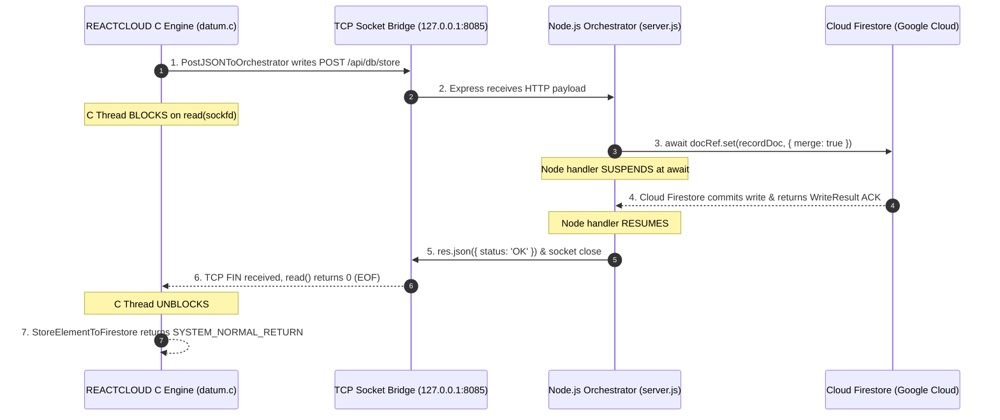

# Architectural Guarantee of Synchronous Firestore Writes in REACTCLOUD & Orchestrator

## Overview

In the REACTCLOUD system, data persistence has transitioned from local GNU Database Manager (`gdbm`) binary files to Google Cloud Firestore via a local HTTP IPC bridge managed by the Node.js Orchestrator (`server.js`).

A critical requirement for database consistency within REACTCLOUD's C routines (such as `StoreElement` and `StoreSearchKeys`) is that **a database write operation must be fully committed to Cloud Firestore before the C function returns execution to its caller**.

This document explains the end-to-end technical mechanisms across all three layers—REACTCLOUD C Backend, Node.js Orchestrator, and Firebase Admin SDK—that **absolutely guarantee synchronous write completion** prior to function exit.

---

## 1. End-to-End Synchronous Architecture

The write pipeline consists of three synchronous execution tiers:



---

## 2. Tier-by-Tier Synchronization Mechanisms

### Tier 1: REACTCLOUD C Executable (`REACTCLOUD/dbase/datum.c`)

When a record is saved in C via `StoreElement(...)` or `StoreElementToFirestore(...)`, the function calls `PostJSONToOrchestrator(...)`.

#### Blocking Socket Read Loop
In [`datum.c`](file:///Users/edwardblurock/git/WorkFlowProject/REACTCLOUD/dbase/datum.c#L27-L91), socket communication is implemented using standard POSIX blocking TCP sockets:

```c
/* datum.c: lines 67-89 */
if (write(sockfd, header, strlen(header)) < 0 || write(sockfd, json_body, body_len) < 0) {
    printf("[Firestore IPC Error] Failed writing request body\n");
    close(sockfd);
    return -1;
}

if (response_buf && response_buf_size > 0) {
    /* ... read response into buffer ... */
} else {
    char dummy[256];
    ssize_t nread;
    while ((nread = read(sockfd, dummy, sizeof(dummy))) > 0) {
        /* Drain socket response so request fully completes on server before returning */
    }
}

close(sockfd);
return 0;
```

#### Why C Execution Cannot Proceed Prematurely:
1. **Blocking System Call**: The socket `sockfd` is created in default **blocking mode**.
2. **Explicit EOF Drain**: The `while ((nread = read(sockfd, ...)))` loop forces the operating system kernel to suspend the C process thread until:
   - The Orchestrator writes its complete HTTP response back over TCP, **and**
   - The Orchestrator closes the TCP connection (sending a TCP `FIN` packet), causing `read()` to return `0` (EOF).
3. **No Background Execution**: The C code does not spawn async threads, non-blocking sockets, or background write queues. Control returns to `StoreElementToFirestore` and then `StoreElement` **only after `PostJSONToOrchestrator` finishes draining the socket**.

---

### Tier 2: Local Node.js Orchestrator (`REACTCLOUD/orchestrator/server.js`)

The Node.js Orchestrator exposes endpoints `/api/db/store` and `/api/db/storeSearchKeys`.

#### JavaScript `await` Operator
In [`server.js`](file:///Users/edwardblurock/git/WorkFlowProject/REACTCLOUD/orchestrator/server.js#L632-L668):

```javascript
/* server.js: lines 632-668 */
app.post('/api/db/store', async (req, res) => {
  try {
    const { uid = 'user_default_local', dbName, key, keyId, jsonStr } = req.body;
    // ... document formatting ...

    const docPath = `users/${uid}/databases/${dbName}/records/${key}`;
    const docRef = firestore.doc(docPath);

    // CRITICAL GUARANTEE: Handler execution suspends here until Cloud Firestore write completes
    await docRef.set(recordDoc, { merge: true });

    console.log(`[Firestore DB Store] Saved record: ${docPath}`);
    return res.json({ status: 'OK', path: docPath });
  } catch (err) {
    console.error('[Firestore DB Store Error]', err.message);
    return res.status(500).json({ error: err.message });
  }
});
```

#### Why Node.js Cannot Send Response Prematurely:
1. **Promise Suspension**: `docRef.set(...)` returns a JavaScript `Promise<WriteResult>`.
2. **Sequential Control Flow**: The `await` keyword pauses execution of the async express handler. `res.json(...)` on line 663 is **physically unreachable** until the `docRef.set()` Promise resolves successfully.
3. **No Unhandled Promises**: The write is not fired off as a background floating promise (`docRef.set(...)` without `await`). Express is blocked from finishing the HTTP response until Firestore confirms write completion.

---

### Tier 3: Firebase Admin SDK & Cloud Firestore Service

The `@google-cloud/firestore` Admin SDK manages gRPC communication with Google Cloud Firestore backend infrastructure.

#### Storage Commitment Guarantee
1. **Network ACK**: `docRef.set()` sends a write mutation request via gRPC to Cloud Firestore.
2. **Server-Side Commit**: Cloud Firestore receives the write payload, writes it to persistent storage across storage nodes, updates database indexes, and assigns a commit timestamp (`WriteResult.writeTime`).
3. **Promise Resolution**: Cloud Firestore responds to the Admin SDK with a success acknowledgement (`CommitResponse`). Only upon receiving this acknowledgment does the SDK resolve the `Promise`.

---

## 3. Error Propagation & Failure Safety

If an error occurs at any point in the write pipeline, the synchronous chain guarantees immediate detection rather than silent failure:

| Failure Scenario | Behavior in Orchestrator (`server.js`) | Behavior in C Engine (`datum.c`) |
| :--- | :--- | :--- |
| **Firestore Network / Permission Error** | `docRef.set()` rejects Promise -> `catch` block catches error -> Sends `HTTP 500`. | `PostJSONToOrchestrator` receives HTTP status 500, socket closes, C logs error or handles status return. |
| **Orchestrator Unreachable / Down** | N/A (Server not responding). | C socket `connect()` fails immediately with `ECONNREFUSED`, logs IPC error, returns `-1`. |
| **Malformed JSON Payload** | Handled in `try...catch` -> Returns `HTTP 400/500`. | C `PostJSONToOrchestrator` completes read, receives error response. |

---

## 4. Summary of Guarantees

When a function call like `StoreElement(...)` in REACTCLOUD completes and returns `SYSTEM_NORMAL_RETURN`:

1. ✅ **Cloud Commitment**: The record has been written and committed to persistent storage in Cloud Firestore.
2. ✅ **Read-After-Write Consistency**: Immediate subsequent calls to `FetchElementFromFirestore` will reliably retrieve the newly updated record.
3. ✅ **Zero Race Conditions**: No background write jobs or unhandled async tasks remain pending in either the C process or Node.js Orchestrator.
